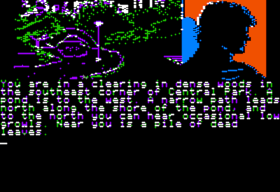
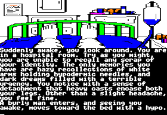

## Spinnaker Adventure System

 

#### Used by Telarium and Windham Classics adventure games

## Introduction

I wasn't able to find any technical information on the web pertaining to [Spinnaker Software](https://en.wikipedia.org/wiki/Spinnaker_Software)'s \"Spinnaker Adventure System\" (SAS) or its \"Spinnaker Adventure Language\" (SAL), used in creating adventure games published by Spinnaker's imprints Windham Classics and Trillium/Telarium [the name changed to the latter because of a trademark dispute]. Besides the article linked above, there is some interesting historical background that can be found at filfre.net: a series of articles beginning with [this one](https://www.filfre.net/2013/09/bookware/), and a piece focusing on [Byron Preiss](https://www.filfre.net/2022/09/byron-preisss-games-or-the-perils-of-the-electronic-book/).

 

Because I feel nostalgic about some of these games, but at the same time find their input text parser to be extraordinarily frustrating, I wanted to update one or more of them to a choice-based format that would enable modern players to better enjoy them. As a first step along this path, I'm documenting here my discoveries from examining the binaries for these games and comparing the various games to one another and their different ports, and for what little it might be worth, sharing the Tester Tool I created in C# to assist in my analysis. I have no particular experience in reverse engineering, but hopefully this will inspire and assist the beginning of such an effort. For instance, it'd be great to eventually have these games added to [Gargoyle](https://ccxvii.net/gargoyle/) and/or [ScummVM](https://www.scummvm.org/)'s Glk engine, which could provide an enhanced experience compared to DOSBox.

---

### NOTE: To analyze a game, the Tester Tool expects to find it in a subdirectory of "Resources\\". It must be named using the game's abbreviation from the table below, followed by the port's abbreviation (e.g., "AMBAII" or "PMNIBM").

These are the games created with the Spinnaker Advanture System:


| game                                         | abbrev | year | imprint           | Apple II | Atari ST | Commodore 64 | IBM PC/PCjr | Macintosh | MSX* |
| ---------------------------------------------- | -------- | ------ | ------------------- | ---------- | ---------- | -------------- | ------------- | ----------- | ------ |
| Amazon                                       | AMZ    | 1984 | Trillium/Telarium | AII      | AST      | C64          | IBM         | MAC       | MSX  |
| Dragonworld                                  | DGW    | 1984 | Trillium/Telarium | AII      |          | C64          | IBM         | MAC       | MSX  |
| Fahrenheit 451                               | F451   | 1984 | Trillium/Telarium | AII      | AST      | C64          | IBM         | MAC       | MSX  |
| Nice Princes in Amber                        | AMB    | 1985 | Telarium          | AII      | AST      | C64          | IBM         |           | MSX  |
| Perry Mason: The Case of the Mandarin Murder | PMN    | 1985 | Telarium          | AII      | AST      | C64          | IBM         |           | MSX  |
| Rendezvous with Rama                         | RDV    | 1984 | Trillium/Telarium | AII      |          | C64          | IBM         |           | MSX  |
| Treasure Island                              | TRI    | 1985 | Windham Classics  | AII      | AST      | C64          | IBM         |           | MSX  |
| The Wizard of Oz                             | WOZ    | 1984 | Windham Classics  | AII      |          | C64          | IBM         |           | MSX  |

\* = The MSX ports were published by Idealogic, in Spanish only. They appear to use a different engine altogether, so much of the information below does not apply.

## Unextracted ports

I have managed to extract files from all known dumps except AMZAII. Due to copy protection, I am unable to extract one of the files from most of the Atari games.

## PDS container files

For some reason, the pictures and music for AMZAST, AMBAII, and AMBAST have been packed into files called GRAPHPDS and MUSICPDS. Additionally, all 3 of the Mac ports have a similarly packed set of files with a different header format ending with .pds. See below for more information about the [PDS container format](#pds-container-format).

## Vocabularies

The vocabulary files list all of the words the parser understands. Note that nearly all words are truncated, but the game can be played this way, e.g. "EXAM CHAL" will examine the chalice. For DGW & RDV, the vocabularies are embedded in the .EXE files.

## Tokenization in "Nine Princes"

To save disk space, AMB (only) uses a tokenizer of its 256 most common words to shrink the text strings a bit. Starting at address 0x102 of AMB.TOK is a list of words, from which can be created a dictionary with a serialized index. If a char is `0x80` or greater within any of the string lists from the Amber location files, then that represents the number of the token word--just subtract `0x80`. The Tester Tool expands strings for "Nine Princes" automatically.

## Amiga port of "Perry Mason"

An Amiga magazine reviewed "Perry Mason" (and is referenced by [the Wikipedia article](https://en.wikipedia.org/w/index.php?title=Perry_Mason:_The_Case_of_the_Mandarin_Murder)), but I can find no other indication that Amiga ports were created. Perhaps the magazine was reviewing the C64 version.

## Macintosh ports

There are Mac ports for at least 3 of the games: "Amazon", "Dragonworld", and "Fahrenheit 451." The pictures are similar but in a higher resolution and in black-and-white. I also saw somewhere that "Rendezvous with Rama" may also have a Mac port, but I haven't been able to find it (perhaps the reference was mistakenly referring to "Rama", an entirely different game based on the same book). As mentioned above, graphics, sounds, and strings/data for these ports are packed into .pds files. The [PDS container format](#pds-container-format) is described below.

## MSX ports

Finally there's the Spanish-only remakes for MSX with redrawn art in a different style. I suspect it's a different engine. However, it's difficult to test these; the SAS parser is hard enough to deal with when you're fluent in the language. Trying to use Google Translate as an intermediary is quite painful!

## File types

Some observations about the files used by these games: Thankfully, game strings are ASCII-encoded (though AMB is partially tokenized).


| filename                | games           | platforms               | description                                                                                                                                            |
| ------------------------- | ----------------- | ------------------------- | -------------------------------------------------------------------------------------------------------------------------------------------------------- |
| \<abbrev\>              | all             | all                     | Strings and data used globally.                                                                                                                        |
| **DEFAULTS.CST**        | AMB only        | AST only                | I'm guessing these are strings and data used globally.                                                                                                 |
| **0** \| **1**          | DGW & RDV       | IBM only                | I'm guessing these are strings and data used globally across a specific disk.                                                                          |
| **A** \| **B**          | AMB, F451, PMN  | IBM only                | I'm guessing these are strings and data used globally across a specific disk. On some ports, they might be save files.                                 |
| **A** \| **B** \| **C** | all             | MSX only                | I'm guessing these identify the current disk.                                                                                                          |
| **AMBGLOB**             | AMB only        | AII,C64,IBM,MSX         | Additional strings and data used globally for AMB.                                                                                                     |
| **NEWDATA**             | all but TRI     | AII,C64,IBM,MAC         | Additional help particular to this game.                                                                                                               |
| **VOLT**                | all             | AII,C64,IBM,MAC         | Identifies the current disk.                                                                                                                           |
| **SAVED**               | all             | all                     | Saved game file.                                                                                                                                       |
| **\*.DIB**              | F451 & RDV only | MSX only                | Maybe [graphics files](#picture-format) for F451 and RDV on MSX?                                                                            |
| \<abbrev\>**.DIB**      | AMB & PMN only  | IBM only                | Directory of locations with disk numbers ("a" or "b") for AMB & PMN on IBM.                                                                            |
| **\*.GST**              | PMN & TRI only  | AST only                | [Graphics files](#picture-format) for PMN and TRI on Atari ST.                                                                             |
| **DIR**                 | all but AMB,PMN | all                     | Directory of locations with disk numbers ("a" or "b").                                                                                                 |
| \<abbrev\>**.DST**      | AMB,AMZ,PMN,TRI | AST only                | Directory of locations with disk numbers ("a" or "b").                                                                                                 |
| **OUTSIDE**             | AMB only        | AST only                | Additional directory of locations with disk nmbers ("a" or "b") for AMB on AST.                                                                        |
| \<abbrev\>**.EXE**      | all             | IBM only                | The game executable for IBM. Note a few game strings are found here, though most strings here are applicable to the game engine generally.             |
| \<abbrev\>**.PRG**      | all             | AST only                | The game executable for Atari ST. Note a few game strings are found here, though most strings here are applicable to the game engine generally.        |
| **AVENTURA.COM**        | all             | MSX only                | The game executable for MSX. The Directory of locations and Vocabulary are embedded here.                                                              |
| **TRILL**               | all             | AII & C64 only          | Maybe the game executable?                                                                                                                                   |
| **TRILLIUM**            | all             | AII & C64 only          | An intro [sound file](#sound-format)                                                                                                                               |
| **\*.STR**              | PMN             | AST, C64, & IBM         | Strings for some location files have been separated into a separate file.                                                                              |
| **\*.STR**              | AMB, AMZ, & PMN | MSX only                | Some game strings that have been separated into separate files on MSX.                                                                                 |
| \<abbrev\>**.T**        | AMB, PMN, & WOZ | AST, C64, & IBM         | Maybe a list of game functions? |                                                                                                                              |
| \<abbrev\>**.TOK**      | AMB only        | AII,AST,C64,IBM         | [Token file](#tokenization-in-nine-princes).                                                                                                           |
| \<abbrev\>**.V**        | all but DGW,RDV | all but AST             | [Vocabulary file](#vocabularies).                                                                                                                      |
| **\*.IB** \| **\*.JR**  | all             | IBM only                | [Sound files](#sound-format) in IBM PC and PCjr formats.                                                                                                                |
| **\*.MST**              | PMN & TRI only  | AST only                | [Sound files](#sound-format) for PMN and TRI on Atari ST.                                                                                                               |
| **\*.FEN**              | AMB only        | all                     | Data specific to the fencing (swordfighting) events for AMB.                                                                                           |
| **\*.STR**              | PMN only        | all                     | Some game strings have been separated into separate files for PMN (especially for cross-examinations?)                                                 |
| **\*.CST**              | AMB,AMZ,PMN,TRI | AST only                | Location files.                                                                                                                                        |
| **GRAPHPDS**            | AMB & AMZ only  | AII & AST only          | [Packed graphics files](#pds-container-format).                                                                                                                                 |
| **MUSICPDS**            | AMB & AMZ only  | AII & AST only          | [Packed sound files](#pds-container-format).                                                                                                                                    |
| **\*.PDS**              | all             | MAC only                | [Packed graphics, sound, and strings/data files](#pds-container-format).                                                                                                        |
| **\*.** (no extension)  | all             | IBM only                | Mostly location or [graphics](#picture-format) files. Some games use format \<first initial abbrev\> + \<number\> with no extension for graphics files. |
| **\*.** (no extension)  | all             | all but IBM & some AST  | Many games use format\<full abbrev\> + \<description\> for sound files. Most non-IBM ports don't have extensions for sound files.                      |

Game strings and other data is found in the appropriate location files.

## PDS Container Format

The Tester Tool has a function to unpack the contents of all files of the selected port type. It also allows a preview hex dump for the files of individual ports.

### Apple II container format

With the 4 GRAPHPDS and 4 MUSICPDS files (one for each disk) from the Apple II port of "Nine Princes": the first two bytes represent the total number of bytes in the file in little endian (i.e., 2nd byte then 1st byte); though for some reason it seems the value given is always 5 bytes larger.

There is a `00` separator, then address 0x03 is the number of file entries, and another `00` separator.

At byte 0x05, the filenames begin, with 12 characters (8.3) per filename, padded with `00`'s where necessary. After a `00` separator, we have three bytes (again in little endian), representing the starting address of that file within the PDS file. Then there's another `00` separator before the next filename.

### Atari ST container format

For the GRAPHPDS/MUSICPDS files from the Atari ST ports of "Amazon" (2 files) and "Nine Princes" (1 file), the format is the same as the Apple II except the initial three bytes are not present. The first byte is the number of file entries, then the file list starts at address 0x02; otherwise it appears to be the same.

### Macintosh container format

For the pix*.pds (graphics), mus*.pds (sound), and ctx*.pds (strings and data) files from the Macintosh ports of "Amazon", "Dragonworld", and "Fahrenheit 451", the format differs from the above. The first two bytes are the starting address of the data section (little-endian). For some reason, this address is repeated at 0x2 and 0x3. Between `00` separators, there is a section between 0x05 and 0x08 that seems to always be `01 20 20 20`. I'm unclear what this represents. The filename entries for Mac begin at 0x0A. Unlike the Apple and Atari, the filenames have a max length of only 8, and `00` and/or `20` is used as filler where necessary. There is no separator before an ending 4 bytes; unlike the above this value is the file's length (rather than the address within the PDS file); it is little-endian rather than big; and for some reason similar to the address at the beginning, it is 2 bytes repeated twice. The first file is always a 1-byte file called dummy1 which I assume aids the SAS PDS parsing routine.

## Picture Format

The Tester Tool permits you to export all pictures to .PNG from the IBM versions of all 8 games. You can also get a preview of an individual file with ANSI block characters. Note that the Tester's list of pictures shows files with no extension that weren't found in the location dir file (other than \<abbrev\>,1,2,A,B,DIR,NEWDATA,SAVED,VOLT), but there may be false positives.

For the IBM versions, SAS uses 320x200 medium-resolution CGA, which supports three 4-color palettes and 2 intensity levels; these games only use low intensity and the first 2 palettes. Note that the Atari ST and Commodore 64 versions use the same resolution, but with 16 color support. The Apple II versions use the 280x192 resolution, with 6 "fringed" colors.

Pictures are either placed at the top in landscape orientation, fullscreen width with (typically) 40% of the screen height, or on one side in portrait orientation, with 45% of the screen width. Note that "Amazon" was ported to SAS from Apple II, and it uses most of the screen for its pictures (`0xA0` for both height and width, or 320x160) [plus the text is in all-caps, ungh]. My initial analysis was done on the IBM PC port, and the Tester Tool is designed for that version, but I've begun the process of recognizing other ports.

### IBM PC/PCjr picture format

#### Header

The first 6 bytes are used as a header with the following layout:


| address | use          | description                                                                                                                                                                                                      |
| --------- | -------------- | ------------------------------------------------------------------------------------------------------------------------------------------------------------------------------------------------------------------ |
| 00      | Palette      | For PC CGA,`00`=GRY (Green/Red/Yellow) or `01`=CMW (Cyan/Magenta/White)                                                                                                                                          |
| 01      | Intensity/Bg | For PC CGA, 1st hex nibble is intensity (`0`=low; `1`=bright), 2nd is background color (0-F) corresponding to PC color codes*                                                                                    |
| 02      | Unknown      | Lots of variance. Maybe an identifier of some kind? Differs between ports.                                                                                                                                       |
| 03      | Unknown      | Small variance, i.e.`00`-`10`?; Probably buffer size: the game freezes after drawing is complete when values are too large, or the drawing does not complete when values are too small. Same values in PC and C64. |
| 04      | Height       | For PC and C64, typically either`B0` (176px) = 88% height, or `50` (80px) = 40%-height                                                                                                                           |
| 05      | Width / 2    | For PC and C64, typically either`A0` (160=>320px) = 100% width, or `48` (72=>144px) = 45%-width; though this field seems to be ignored                                                                           |

\* = For PC: 0=black, 1=dk.blue, 2=dk.green, 3=dk.cyan, 4=dk.red, 5=dk.magenta, 6=dk.yellow, 7=br.gray, 8=dk.gray, 9=br.blue, 10=br.green, 11=br.cyan, 12=br.red, 13=br.magenta, 14=br.yellow, 15=white

#### Pixel data

The rest of the file is pixel data. Though I don't have much experience with image formats, it seems a bit odd. It's similar to sixel (which I gather is odd enough), except this is "fourxel" and it's rotated 90 degrees. Four-pixel wide blocks are laid out top to bottom, with each block being from 0-15 pixels high. A set of three bytes represents two of these blocks, with the first byte's color map given by the 1st nibble (hexadecimal digit) of the second byte, and the 2nd nibble of the second byte gives the height of the color map in the third byte, i.e.:


| byte1 (00-FF) | byte2 nibble1 (0-F) | byte2 nibble2 (0-F) | byte3 (00-FF) |
| --------------- | --------------------- | --------------------- | --------------- |
| color map     | height for byte1    | height for byte3    | color map     |

The following 3 bytes will place the next set of 2 blocks below the previous ones, until the height from the header 0x04 is met, then further pixels are moved back to the top and shifted right by 4 pixels. The width in header 0x05 appears to be ignored.

Color Maps:
The color maps are base-4 bitmasks for the color of each of the 4 pixels. See the table below for an excerpt (the palette columns assume the background color is black):


| hex data | color map | palette 0                                                                                                                                          | palette 1                                                                                                                                            |
| ---------- | ----------- | ---------------------------------------------------------------------------------------------------------------------------------------------------- | ------------------------------------------------------------------------------------------------------------------------------------------------------ |
| `00`     | 0 0 0 0   | <code style="color : DarkGray">K K K K</code>                                                                                                      | <code style="color : DarkGray">K K K K</code>                                                                                                        |
| `01`     | 0 0 0 1   | <code style="color : DarkGray">K K K</code><code style="color : Green">G</code>                                                                    | <code style="color : DarkGray">K K K</code><code style="color : Cyan">C</code>                                                                       |
| `02`     | 0 0 0 2   | <code style="color : DarkGray">K K K</code><code style="color : Red">R</code>                                                                      | <code style="color : DarkGray">K K K</code><code style="color : Magenta">M</code>                                                                    |
| `03`     | 0 0 0 3   | <code style="color : DarkGray">K K K</code><code style="color : Yellow">Y</code>                                                                   | <code style="color : DarkGray">K K K</code><code style="color : White">W</code>                                                                      |
| `04`     | 0 0 1 0   | <code style="color : DarkGray">K K</code><code style="color : Green">G</code><code style="color : DarkGray">K</code>                               | <code style="color : DarkGray">K K</code><code style="color : Cyan">C</code><code style="color : DarkGray">K</code>                                  |
| `05`     | 0 0 1 1   | <code style="color : DarkGray">K K</code><code style="color : Green">G G</code>                                                                    | <code style="color : DarkGray">K K</code><code style="color : Cyan">C C</code>                                                                       |
| ...      |           |                                                                                                                                                    |                                                                                                                                                      |
| `1B`     | 0 1 2 3   | <code style="color : DarkGray">K</code><code style="color : Green">G</code><code style="color : Red">R</code><code style="color : Yellow">Y</code> | <code style="color : DarkGray">K</code><code style="color : Cyan">C</code><code style="color : Magenta">M</code><code style="color : White">W</code> |
| ...      |           |                                                                                                                                                    |                                                                                                                                                      |
| `6C`     | 1 2 3 0   | <code style="color : Green">G</code><code style="color : Red">R</code><code style="color : White">W</code><code style="color : DarkGray">K</code>  | <code style="color : Cyan">C</code><code style="color : Magenta">M</code><code style="color : White">W</code><code style="color : DarkGray">K</code> |
| ...      |           |                                                                                                                                                    |                                                                                                                                                      |
| `B1`     | 2 3 0 1   | <code style="color : Red">R</code><code style="color : Yellow">Y</code><code style="color : DarkGray">K</code><code style="color : Green">G</code> | <code style="color : Magenta">M</code><code style="color : White">W</code><code style="color : DarkGray">K</code><code style="color : Cyan">C</code> |
| ...      |           |                                                                                                                                                    |                                                                                                                                                      |
| `C6`     | 3 0 1 2   | <code style="color : Yellow">Y</code><code style="color : DarkGray">K</code><code style="color : Green">G</code><code style="color : Red">R</code> | <code style="color : White">W</code><code style="color : DarkGray">K</code><code style="color : Cyan">C</code><code style="color : Magenta">M</code> |
| ...      |           |                                                                                                                                                    |                                                                                                                                                      |
| `FA`     | 3 3 2 2   | <code style="color : Yellow">Y Y</code><code style="color : Red">R R</code>                                                                        | <code style="color : White">W W</code><code style="color : Magenta">M M</code>                                                                       |
| `FB`     | 3 3 2 3   | <code style="color : Yellow">Y Y</code><code style="color : Red">R</code><code style="color : Yellow">Y</code>                                     | <code style="color : White">W W</code><code style="color : Magenta">M</code><code style="color : White">W</code>                                     |
| `FC`     | 3 3 3 0   | <code style="color : Yellow">Y Y Y</code><code style="color : DarkGray">K</code>                                                                   | <code style="color : White">W W W</code><code style="color : DarkGray">K</code>                                                                      |
| `FD`     | 3 3 3 1   | <code style="color : Yellow">Y Y Y</code><code style="color : Green">G</code>                                                                      | <code style="color : White">W W W</code><code style="color : Cyan">C</code>                                                                          |
| `FE`     | 3 3 3 2   | <code style="color : Yellow">Y Y Y</code><code style="color : Red">R</code>                                                                        | <code style="color : White">W W W</code><code style="color : Magenta">M</code>                                                                       |
| `FF`     | 3 3 3 3   | <code style="color : Yellow">Y Y Y Y</code>                                                                                                        | <code style="color : White">W W W W</code>                                                                                                           |

- key: K=black, B=blue, G=green, C=cyan, R=red, M=magenta, Y=yellow, W=white

#### Decoding the Color Map

It took me an embarrassingly long time to figure out the appropriate bitwise operation to read out a base-4 bitmask, so if I might save you the trouble:

```
colorMap[0] = (byteArray >> 6) & 0x3;
colorMap[1] = (byteArray >> 4) & 0x3;
colorMap[2] = (byteArray >> 2) & 0x3;
colorMap[3] = byteArray & 0x3;
```

#### Examples

So, take an example 3 bytes: `1B F7 C6`. You'll get a 4x15-pixel block above a 4x7-pixel block, with sets of 4-color stripes based on the color map. If it's palette `0`, low-intensity and a black background, you'll get the following (8x zoom for clarity):


| 1B          | F         |   | 7        | C6          |
| ------------- | ----------- | --- | ---------- | ------------- |
| colors 0123 | 15px high |   | 7px high | colors 3012 |

##### AMB\\HOSPITL

So, taking the first location of "Nine Princes in Amber" as an example:


| address | `00 01 02 03 04 05` |
| --------- | --------------------- |
| data    | `01 00 C9 03 50 A0` |

Looking at the header, we see:

- `0100` = palette 1 (KCMW), low-intensity and black background.
- `C903` = unknown
- `50A0` = 320x80 (fullscreen width, top 40% of screen)


| offset | `00 01 02 03 04 05 06 07 08 09 0A 0B 0C 0D 0E 0F` |
| -------- | --------------------------------------------------- |
| 00     | `-- -- -- -- -- -- FF FF FF FF FF FF FF 11 00 FF` |
| 10     | `71 FC F0 11 01 05 11 15 54 11 51 11 13 55 FF 61` |
| ...    |                                                   |

Looking at the pixel data, we see that it's pretty boring at first: 61 pixels down of all white. Then 1 of all black, and seven more all white. Finally, a set of 1 pixel-high mixed black and white, and then some black and cyan until the bottom of the picture height, and back to the top of the screen (shifted by 4 pixels to the right) for the next block of white.

Note that this file doesn't include the feet shown; these are drawn with a small separate picture file (called FEET), then HOSPITL is redrawn when the player stands up.


| address | color data                                                                                                                                                | height  |   | address | height  | color data                                                                                                           |
| --------- | ----------------------------------------------------------------------------------------------------------------------------------------------------------- | --------- | --- | --------- | --------- | ---------------------------------------------------------------------------------------------------------------------- |
| 06      | `FF`=<code style="color : White">W W W W</code>                                                                                                           | `F`=x15 |   | 08      | `F`=15x | `FF`=<code style="color : White">W W W W</code>                                                                      |
| 09      | `FF`=<code style="color : White">W W W W</code>                                                                                                           | `F`=x15 |   | 0B      | `F`=15x | `FF`=<code style="color : White">W W W W</code>                                                                      |
| 0C      | `FF`=<code style="color : White">W W W W</code>                                                                                                           | `F`=x1  |   | 0E      | `1`=1x  | `00`=<code style="color : DarkGray">K K K K</code>                                                                   |
| 0F      | `FF`=<code style="color : White">W W W W</code>                                                                                                           | `7`=x7  |   | 11      | `1`=1x  | `FC`=<code style="color : White">W W W</code><code style="color : DarkGray">K</code>                                 |
| 12      | `F0`=<code style="color : White">W W</code><code style="color : DarkGray">K K</code>                                                                      | `1`=x1  |   | 14      | `1`=1x  | `01`=<code style="color : DarkGray">K K K</code><code style="color : Cyan">C</code>                                  |
| 15      | `05`=<code style="color : DarkGray">K K</code><code style="color : Cyan">C C</code>                                                                       | `1`=x1  |   | 17      | `1`=1x  | `15`=<code style="color : DarkGray">K</code><code style="color : Cyan">C C C</code>                                  |
| 18      | `54`=<code style="color : Cyan">C C C</code><code style="color : DarkGray">K</code>                                                                       | `1`=x1  |   | 1A      | `1`=1x  | `51`=<code style="color : Cyan">C C</code><code style="color : DarkGray">K</code><code style="color : Cyan">C</code> |
| 1B      | `11`=<code style="color : DarkGray">K</code><code style="color : Cyan">C</code><code style="color : DarkGray">K</code><code style="color : Cyan">C</code> | `1`=x1  |   | 1D      | `3`=3x  | `55`=<code style="color : Cyan">C C C C</code>                                                                       |
| 1E      | `FF`=<code style="color : White">W W W W</code>                                                                                                           | `6`=x6  |   | ...     | `1`=1x  | ...                                                                                                                  |

### Commodore 64 picture format


OK, I've just started this analysis, but here's what I've got so far.

It's clearly a different format from IBM, but the header is similar, and there appeared to be the tantalizing similarity of three byte sequences starting at address 0x65 (after the third reference to [50A0], the resolution). Twiddling bits showed me that I was sort of correct; that there was indeed something similar going on here with a pattern of blocks with colors being placed in the first and third byte, and a size in each of the 2 nibbles of the second byte. However, here it was instead doing color fills. So the colors are also split into nibbles, with each one representing one of 16 colors in the current palette:


| 0        | 1        | 2            |   | 3            | 4        | 5        |
| ---------- | ---------- | -------------- | --- | -------------- | ---------- | ---------- |
| color A2 | color A1 | num blocks A |   | num blocks B | color B1 | color B2 |

So, returning to "Nine Princes" for our example:


| 0x65       | 0x68       | 0x6B       | 0x6E       |
| ------------ | ------------ | ------------ | ------------ |
| `F0 71 FC` | `6C 11 60` | `1F 12 10` | `1F 13 0F` |

After experimenting, it looks like the palette is slightly different from the default C64 palette.* So that means there's probably going to be another section of the file that assigns colors. Looking at `F0`, I discover that Color `F` is light gray on both this and the default palette; same for Color `0`: black; but here it looks like black is a no-op because there are no dividing lines in the top-left 4x8 pixel block, nor are there any for the next 6 blocks. And so the `7` in "num blocks A" says to use the same fill colors for seven 4x8 blocks. The next nibble, "num blocks B", is `1`, saying that the third byte's colors are only going to apply to the one block. And this block occurs on both sides of the dividing line between the wall and the floor; the wall being color `F` again, and the floor being color `C`, the medium gray.

\* = C64 default palette: 0=black, 1=white, 2=red, 3=cyan, 4=purple, 5=green, 6=blue, 7=yellow, 8=orange, 9=brown, 10=yellow-green, 11=rosa, 12=blue-green, 13=lt.blue, 14=zyklam [purple-blue], 15=lt.green

Looking to the next three bytes, `6` is the blue used on the bed. But why is `6` listed before `C`? It appears that the first byte fills from the bottom first, unlike the third byte; so perhaps what happens with the first byte in 0x65 is that the black *isn't* a no-op; it just fills it with black first and then gray goes on top because there's no dividing line here? Could be...

...No, it looks like it doesn't have to have a black border to be a divider, so there's something else that marks division between color boundaries.

In any case, the three-byte pattern looks like it changes again around address 0x1D6, a couple bytes before repeating the resolution (this time including the prior two bytes of the header; the ones I'm unclear on, after giving the signal `1010`). So what's next? ...Or should I return to the top of the file and see if that's where the palette is being set?

### Atari ST picture format

 

Though the ST had a more flexible color system than the Commodore, based on the screenshots it doesn't look like Telarium really leveraged it very well. In any case, I've only done a quick comparison to the C64 format at this point, and it appears to be very different.

### Apple II picture format

 

I have yet to look at these.

### Macintosh picture format


Similar art style in high-res, but black-and-white only.

### MSX picture format

 

Redrawn art in a new art style.

### Animations

Some of the graphic files invoke simple animations (for "Amazon" in particular), but I haven't yet done an analysis of those.

## Sound Format

These games feature some music and sound effects that are... serviceable.

I've got the format figured out for the most part, but there are some bugs to work out. For what it's worth, the Tester Tool permits you to export all audio files to .MID for all games (except MSX ports) as far as my current understanding goes (and will automatically extract files from PDS containers first), but the pitch is incorrect in some cases. The tool will also preview sound files for individual games, but in that case it will only play one channel at a time.

So here's what I've deciphered so far:

### IBM PC/PCjr sound format

The IBM ports come with two sound file formats, \*.IB for the IBM PC internal speaker (monophonic) and \*.JR for the IBM PCjr [TI SN76489 chip](https://en.wikipedia.org/wiki/Texas_Instruments_SN76489) (polyphonic, featuring a 3-channel square wave generator, and a 1-channel white noise generator, though I'm pretty sure the noise channel is not used on the IBM ports).

#### Header

The first byte (at 0x00) is highly variable; it seems to be a buffer size, as I got it to play part of a prior sound file after increasing the size. The second byte (0x01) has a very small range (`00`-`02` I think). The first often varies between IB and JR formats, and the second sometimes does as well.

The third (0x02) does not appear to vary between formats. It represents the timespan of the shortest beat length. The range is also small (`01`-`08`). I believe you simply multiply the number by 16 to get the number of milliseconds for each beat (so larger numbers equal a slower tempo).

0x03 and 0x04 seem to always be `18 00`.

For monophonic files (which includes many of the \*.JR files which are duplicates of the \*.IB ones), the next 6 bytes are all `00`s, whereas for polyphonic \*.JR files, 0x05 and 0x07 often have a wide variance, where positions 0x06 and 0x08 have a very small range (`00`-`03`), though usually both are `00`. Based on my limited experiments, 0x05 and 0x07 seem to adjust both octave and starting position of the track, for the second and third channel respectively; where 0x06 and 0x08 might be adjustments to the buffer size.

0x09 and 0x10 are always `00`.

#### Note Lengths

The 15 bytes between positions 0x0B and 0x19 comprise a new section that specifies an array of note lengths that are used in the section below.

#### Note Data

For the rest of the file, starting at 0x1A, we have note data. The control code at the beginning is always `50 00 08 40 00 80` on IBM. For polyphonic files, a similar sequence starting with `50` will start a new channel after an `80` stop control code. The new channel begins at the beginning of the song and plays at the same time as the prior channel. I'm unclear on some of the specifics of this sequence, but the `08 40` is used for PC speaker or for square waves on the PCjr. Other ports sometimes have different waveform values. Also, the `80` at the end doesn't indicate a stop (or even a start) control code as it would during the note data proper; it can differ in some ports.

The first byte that follows the new channel sequence could indicate one or more rests (see next section below), but before the first audible note there should be a `00` followed by a byte between `C2` and `FF`. This indicates an absolute pitch value. This may seem a fairly narrow range of values to represent a ~2500 Hz range, except that since only musical notes will be specified, this actually covers more than 4 octaves of a chromatic scale (and the frequency curve is exponential anyway). See the chart below for some examples. It looks like you can set it to a lower pitch (below A3) with values below `C2` (though it will go no lower than C at octave zero). From my experiments, it seems that notes don't cross over the `C2` line, i.e., pitch changes (see next section below) may end up going down instead of up. The same is not true for pitch changes that go above `FF`; those seem to be allowed.


| hex  | note | midi # | freq (Hz) |
| ------ | ------ | -------- | ----------- |
| `C2` | A2   | 45     | 110.00    |
| ...  |      |        |           |
| `D1` | C4   | 60     | 261.63    |
| ...  |      |        |           |
| `E0` | Eb5  | 75     | 622.25    |
| ...  |      |        |           |
| `F0` | G6   | 91     | 1568.0    |
| ...  |      |        |           |
| `FF` | Bb7  | 106    | 3729.3    |

For the following note values, each byte represents one note or rest. The first nibble is the relative note pitch compared to the prior pitch, with 0 indicating the same note, 1-7 indicating the number of notes above, and 9-F indicating the number of notes below, with `F`=-1, `E`=-2, `D`=-3, etc. to `9`=-7.

If the first nibble is 8, then it is a rest (no sound for the same duration as if it was a regular note)--except for `80`, which remember is the stop control code. A rest does not change the pitch; the pitch of the note following one or more rests is based on the note prior to the rests.

A `00` within the note values seems to indicate a key change, though the value is still relative to the prior note. If the first nibble is 0-7, then the key moves up; I believe the first nibble is the number of octaves; the second is definitely the number of semitones (a.k.a. half-steps). If the first nibble is 9-F, then the key moves down. The second nibble should be subtracted from 0x10 to get the number of semitones to lower, i.e., `F7` means 0x10(16)-0x07(7)=9.

I'm not sure what 2 `00`s indicate...

#### Example

##### AMB\\AMBHORN.IB

This is a short example from "Nine Princes" that emulates the sound of a hunting horn.


| offset | `00 01 02 03 04 05 06 07 08 09 0A 0B 0C 0D 0E 0F`                                                                                     |
| -------- | --------------------------------------------------------------------------------------------------------------------------------------- |
| 000    | `2B 00 08 18 00 00 00 00 00 00 00`<code style="color : Blue">01 06 02 10 01</code>                                                    |
| 010    | <code style="color : Blue">01 01 01 01 01 01 01 01 01 01 </code><code style="color : Green">50 00 08 40 00 80</code>                   |
| 020    | <code style="color : Green">00 C6</code><code style="color : Red">01 72 81 91 71 83 91 74</code><code style="color : Green">80</code> |

The first section is the header. I do know that the value `08` at 0x02, multiplied by 16 (here, 128), represents the timespan in milliseconds per beat. A beat might be thought of as an eighth note (&#9834;) or a sixteenth note (&#x1D161;) or even a 32nd note, depending on the tempo. You should be able to calculate a tempo in standard quarter-note (&#9833;) beats per minute by first multiplying the length in ms by 2 (for 8th note), 4 (for 16th note), or 8 (for 32nd note) to get the length in ms of a quarter note, then use the formula "bpm = 60,000 &div; (beat length &times; note length)". In other words, if the beats in this file are thought of as 16th notes, then the tempo is 60,000 &div; (128 &times; 4), i.e.: &#9833;=117 bpm (where 108-120 is considered moderate).

The second section at 0x0B (in blue) is the 15-element array of note lengths. In this case, in decimal the array is: { 1, 6, 2, 16, 1, 1, 1, 1, 1, 1, 1, 1, 1, 1, 1 }.

The next section at 0x1A (in green) is the control sequence at the start of a channel, which on PC will always be the same. The same sequence will be repeated at the start of a new channel for polyphonic files.

`C6` (at 0x21) is the absolute pitch at the start of the (only) channel. It corresponds with C# in the fourth octave. The following section (in red) represents notes. `01` indicates no pitch change from the prior value, for the note length in the first index of the array (in this case, one beat). `72` indicates a rise of 7 semitones (i.e., C#->D->D#->E->F->F#->G->G#) up to G#, still in the fourth octave, for the length provided in the second index of the array (six beats). The next byte, `81`, since the first nibble is 0x8 and it's not `80` (the stop control code), then it's a rest for the length in the first index of the array (one beat). `91` indicates a fall by 7 half-steps, returning us to C#4, for one beat. In the end, the entirety of the audio is:

C#4 x1, G#4 x6, rest x1, C#4 x1, G#4 x1, rest x2, C#4 x1, G#4 x16

It sounds like: "Da-doooo, da-do da-dooooooo!"

And finally, we get the `80` stop control code.

### Apple II sound format

The three models prior to the IIGS had a very basic speaker. Add-in music cards were available, but SAS only supports this speaker.

Because of this, the sound files are very similar to the .IB versions. There are three extra bytes at the start of the file, however, so the note data doesn't start until address 0x23.

### Atari ST sound format

All four models prior to the STe had a [Yamaha YM2149](https://en.wikipedia.org/wiki/General_Instrument_AY-3-8910), which apparently produces "similar results" to the chip in the PCjr.

Given that, perhaps it should not be surprising that the sound files are very similar to the PCjr versions; some are actually identical. However, it looks like for "Nine Princes" and "Perry Mason" (though the former has them packed into a MUSICPDS file), the first channel control code is 8 bytes instead of 6, and often begins with `50 00 00 00 38 00`. The following two bytes always start with `60`, which is usually followed by `0D`, but is sometimes `0E`, `0F`, or `10`. The second and third channel codes consist of only 2 bytes, again `60` and one of `0D` through `10`.

### Commodore 64 sound format

The C64 files I've analyzed are also very similar to the PCjr ones. The C64's [MOS 6581 SID](https://en.wikipedia.org/wiki/MOS_Technology_6581) is 3-channel, though it is much more flexible with the sounds that it can output (i.e., each channel can use noise generation or 4 different waveforms *simultaneously*, filtration and ADSR envelope modification).

Note I have also heard at least one instance of the noise channel being used by the C64.

There are an additional two bytes at the beginning of a file that are always `20 41` in the ones that I've looked at so far.

The control code at the start of a channel is a bit different. It's still six bytes starting with `50 00`, but the next 4 control the waveform and ADSR envelope. Initially I thought the `80` in the sixth byte on PC and Atari meant that it was both start and stop, but since it varies here it probably doesn't mean start at all. The third byte seems to always be `08` or `0F`, and the latter only affects square waves (per the next byte), and seems to add a duplicate waveform (sawtooth maybe?) with the same pitch on top. The fourth byte is the waveform type: it seems that `10` is triangle, `20` is sawtooth, and `40` is square; I believe `80` is white noise.

C64 also has a final byte after the last `80` that varies: I've seen e.g., `00`, `01`, `02`, `81`, and `FF`.