## Spinnaker Adventure System

**Technical data and an Extractor/Analyzer tool for Telarium and Windham Classics SAS adventure games**

 

## Introduction

I wasn't able to find any technical information on the web pertaining to [Spinnaker Software](https://en.wikipedia.org/wiki/Spinnaker_Software)'s \"Spinnaker Adventure System\" (SAS) or its \"Spinnaker Adventure Language\" (SAL), used in creating 8 adventure games published by Spinnaker's imprints [Windham Classics](https://en.wikipedia.org/wiki/Windham_Classics) and [Trillium/Telarium](https://en.wikipedia.org/wiki/Telarium) [the name changed to the latter because of a trademark dispute]. This development company is somewhat unique as all of their games are based on books (though *Shadowkeep* stretched that definition). Besides the *Wikipedia* article linked above, there is some interesting in-depth historical background that can be found at Jimmy Maher's *filfre.net*: a series of articles beginning with [this one](https://www.filfre.net/2013/09/bookware/) about "bookware" generally, with pieces about most of these games specifically, and in some cases the authors and books on which they are based; and a later article that focuses on [Byron Preiss](https://www.filfre.net/2022/09/byron-preisss-games-or-the-perils-of-the-electronic-book/), a central figure in the development of these games (and the co-author of the book on which the *Dragonworld* game was based).

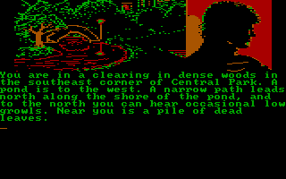 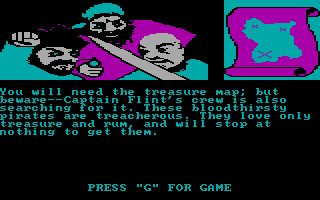

Because I feel nostalgic about some of these games, but at the same time find their input text parser to be extraordinarily frustrating, I wanted to update one or more of them to a choice-based format that would enable modern players to better enjoy them. As a first step along this path, I'm documenting here my discoveries from examining the binaries for these games and comparing the various games to one another and their different ports, and for what little it might be worth, sharing the Tester Tool I created in C# to assist in my analysis. I have no particular experience in reverse engineering, but hopefully this will inspire and assist the beginning of such an effort. For instance, it'd be great to eventually have these games added to [Gargoyle](https://ccxvii.net/gargoyle/) and/or [ScummVM](https://www.scummvm.org/)'s Glk engine, which could provide an enhanced experience compared to DOSBox.

> [!IMPORTANT]
> **To analyze a game, the Tester Tool expects to find its files in a subdirectory of ".\Resources\\". The directory must be named using the game's abbreviation from the [table below](#sas-games), followed by the port's abbreviation (e.g., "AMBAII" or "PMNIBM"):**
>
> Port abbreviations:
>
> * AII = Apple II
> * AST = Atari ST
> * C64 = Commodore 64
> * IBM = IBM PC/PCjr
> * MAC = Macintosh
> * MSX = MSX
>
> **Note if a file called ".\Resources.zip" or ".\Resources\Resources.zip" exists, it will automatically be extracted.**

### Extracting data files

Files must be extracted from disk images before they can be analyzed. These are the tools I used:

* Apple II: [*CiderPress II*](https://ciderpress2.com/)
* Atari ST: [*Steem SEE*](https://sourceforge.net/projects/steemsse/) emulator
* Commodore 64: [*DirMaster*](https://style64.org/dirmaster)
* Macintosh: [*ShrinkWrap*](https://www.macintoshrepository.org/266-shrinkwrap-3-x) app within the [*Basilisk II*](https://basilisk.cebix.net/) emulator
* MSX: [*WinImage*](https://www.winimage.com/winimage.htm)

For Atari, *Steem SSE* allows you to mount a specified directory on the host system as an emulated GEMDOS hard drive; for Mac, *Basilisk II* similarly allows you to add an icon to the guest that mounts specified host drive letters. In the Mac's case, the game's files are hidden from Finder, but they are accessible with the *ShrinkWrap* tool. In either case, files can then be copied from the mounted floppy disk to the emulated hard disk using the guest OS's GUI.

> [!NOTE]
> **There will be duplicate filenames between multiple disks, e.g., for the games with GRAPHPDS/MUSICPDS files, be sure to add an extension to keep the files separate while still allowing the Tester Tool to find them. The VOLT file is less important as it merely identifies the disk.**

> [!NOTE]
> **Unlike the other ports, the Atari ST games will have a subdirectory (named with the abbreviation in the table below) for their data files (all files other than the .PRG executable), and the Tester Tool expects this layout.**

---

## SAS Games

These are the games created with the Spinnaker Adventure System:


| game                                                                                                                         | abbrev | year | imprint             | source author          | ports                                 | manuals                                                                                                                                                                        | reviews                                                                                                                                                                                                                   |
| ------------------------------------------------------------------------------------------------------------------------------ | -------- | ------ | --------------------- | ------------------------ | --------------------------------------- | -------------------------------------------------------------------------------------------------------------------------------------------------------------------------------- | --------------------------------------------------------------------------------------------------------------------------------------------------------------------------------------------------------------------------- |
| [*Amazon*](https://en.wikipedia.org/wiki/Amazon_(video_game))                                                                | AMZ    | 1984 | Trillium / Telarium | Michael Crichton       | AII&dagger;, C64, IBM, MSX*, AST, MAC | [[manual](https://www.mocagh.org/spinnaker/amazon-manual.pdf)]                                                                                                                 | [[Maher](https://www.filfre.net/2013/10/from-congo-to-amazon/)] [[Dobson](https://gamingafter40.blogspot.com/2010/02/adventure-of-week-michael-crichtons.html)] [[Creosote](https://www.goodolddays.net/en/game/Amazon/)] |
| [*Dragonworld*](https://en.wikipedia.org/wiki/Dragonworld_(video_game))                                                      | DGW    | 1984 | Trillium / Telarium | B. Preiss / M. Reaves  | AII, C64, IBM, MSX*, MAC              | [[manual](https://www.mocagh.org/spinnaker/dragonworld-manual.pdf)]                                                                                                            | [[Maher](https://www.filfre.net/2013/10/dragonworld/)]                                                                                                                                                                    |
| [*Fahrenheit 451*](https://en.wikipedia.org/wiki/Fahrenheit_451_(video_game))                                                | F451   | 1984 | Trillium / Telarium | Ray Bradbury           | AII, C64, IBM, MSX*, AST, MAC         | [[manual](https://www.mocagh.org/spinnaker/fahrenheit-manual.pdf)] [[note](https://www.mocagh.org/spinnaker/fahrenheit-note.pdf)]                                              | [[Maher](https://www.filfre.net/2013/09/fahrenheit-451-the-game/)] [[Dobson](https://gamingafter40.blogspot.com/2010/11/adventure-of-week-fahrenheit-451-1984.html)]                                                      |
| [*Nice Princes in Amber*](https://en.wikipedia.org/wiki/Nine_Princes_in_Amber_(video_game))                                  | AMB    | 1985 | Telarium            | Roger Zelazny          | AII, C64, IBM, MSX*, AST              | [[manual](https://www.mocagh.org/spinnaker/nineprinces-manual.pdf)]                                                                                                            | [[Maher](https://www.filfre.net/2014/06/nine-princes-in-amber/)]                                                                                                                                                          |
| [*Perry Mason: The Case of the Mandarin Murder*](https://en.wikipedia.org/wiki/Perry_Mason:_The_Case_of_the_Mandarin_Murder) | PMN    | 1985 | Telarium            | Erle Stanley Gardner   | AII, C64, IBM, MSX*, AST              | [[manual](https://www.mocagh.org/spinnaker/perrymason-manual.pdf)]                                                                                                             | [[Maher](https://www.filfre.net/2014/06/perry-mason-the-case-of-the-mandarin-murder/)] [[Creosote](https://www.goodolddays.net/en/game/Perry-Mason-The-Case-of-the-Mandarin-Murder/)]                                     |
| [*Rendezvous with Rama*](https://en.wikipedia.org/wiki/Rendezvous_with_Rama_(video_game))                                    | RDV    | 1984 | Trillium / Telarium | Arthur C. Clarke       | AII, C64, IBM, MSX*                   | [[manual](https://www.mocagh.org/spinnaker/rama-manual.pdf)] [[hints](https://www.mocagh.org/spinnaker/rama-hints.pdf)] [[map](https://www.mocagh.org/spinnaker/rama-map.pdf)] | [[Maher](https://www.filfre.net/2013/09/rendezvous-with-rama/)]                                                                                                                                                           |
| [*Treasure Island*](https://en.wikipedia.org/wiki/Treasure_Island#Video_games)                                               | TRI    | 1985 | Windham Classics    | Robert Louis Stevenson | AII, C64, IBM, MSX*, AST              | [[manual](https://www.mocagh.org/spinnaker/treasureisland-manual.pdf)] [[map](https://www.mocagh.org/spinnaker/treasureisland-map.jpg)]                                        |                                                                                                                                                                                                                           |
| [*The Wizard of Oz*](https://en.wikipedia.org/wiki/The_Wizard_of_Oz_(1985_video_game))                                       | WOZ    | 1984 | Windham Classics    | L. Frank Baum          | AII, C64, IBM, MSX*                   | [[manual](https://www.mocagh.org/spinnaker/wizardoz-manual.pdf)]                                                                                                               |                                                                                                                                                                                                                           |

##### \* = The MSX versions were published by Idealogic, in Spanish only. They may use a different engine altogether, in which case much of the information below would not apply. [See below](#msx-ports).

##### &dagger; = The Apple II version of *Amazon* was not actually a SAS game; the other ports were adapted to SAS based on it. [See below](#apple-ii-version-of-amazon).

## Ports

The main ports were for Apple II, Commodore 64, and IBM PC/PCjr. Later ports were made to Atari ST and Macintosh for some of the games.

### Atari ST ports

There are Atari ports for 5 of the games: *Amazon*, *Fahrenheit 451*, *Nine Princes*, *Perry Mason*, and *Treasure Island*.

### Macintosh ports

There are Mac ports for 3 of the games: *Amazon*, *Dragonworld*, and *Fahrenheit 451*. The pictures are similar but in a higher resolution and in black-and-white (not even grayscale).

I've seen a reference to a Mac version of *Rendezvous with Rama*, but I believe this is a mistake, probably referring to the 1996 Dynamix game *Rama* (which covers parts of the *Rendezvous* book as well as its sequel, *Rama II*).

### Reported Amiga port of *Perry Mason*

An Amiga magazine apparently reviewed *Perry Mason* (which is referenced by [the Wikipedia article](https://en.wikipedia.org/w/index.php?title=Perry_Mason:_The_Case_of_the_Mandarin_Murder#Reception)), but I can find no other indication that any Amiga ports were created. Perhaps the magazine was reviewing the C64 port.

### MSX ports

Finally there's the Spanish-only remakes for MSX of all 8 games published by a different company, Idealogic. The art was redrawn (or in some cases captured from photos). I'm not sure whether it's a different engine altogether.

I find it difficult to test these; the parser is hard enough to deal with when you're fluent in the language. Trying to use Google Translate as an intermediary is quite painful!

## Non-SAS games

### Apple II version of *Amazon*

*Amazon* was purchased from Michael Crichton as a mostly complete game, though at that point it was based on his book, *Congo*. However, Crichton didn't realize that when he sold the movie rights, he had actually sold all adaptation rights. The *Congo* movie wouldn't actually be released until 1995.

So the game's setting was changed at the last minute from Africa to South America, and the ape that could use sign language was changed to a talking parrot. There were some oversights, like the inclusion of an incident involving hippopotamuses; hippos are not native to South America (though some escaped into the wilds from the notorious Pablo Escobar's zoo in the '90s)!

The game was written in Apple assembly, and was released in its native form, and I'm unable to dump the file contents; presumably the pictures are included in the binary. The other ports were adapted into SAS but from what I've read some features were apparently lost in translation.

The text was in all-caps (ungh!), and the initial ports to Commodore and IBM were as well. Thankfully, they fixed this for the Atari and Macintosh ports.

### Other non-SAS games

For completeness, I'll mention that Telarium published two other non-SAS games during its short life: [*Shadowkeep*](https://en.wikipedia.org/wiki/Shadowkeep_(video_game) [[Maher review](https://www.filfre.net/2013/10/shadowkeep/)] (for Apple II only, and novelized by Alan Dean Foster just so they could say it was also based on a book) and Agatha Christie's [*The Scoop*](https://en.wikipedia.org/wiki/The_Scoop_(video_game) (for Apple II and IBM PC only).

Windham Classics published three others (for Apple II and Commodore 64 only): Zilpha Keatley Snyder's [*Below The Root*](https://en.wikipedia.org/wiki/Below_the_Root_(video_game)), Lewis Carroll's [*Alice in Wonderland*](https://en.wikipedia.org/wiki/Alice_in_Wonderland_(1985_video_game)) (both of which use the same Disharoon engine), and Johann David Wyss's [*The Swiss Family Robinson*](https://en.wikipedia.org/wiki/The_Swiss_Family_Robinson#Other_adaptations).

See [this Maher article](https://www.filfre.net/2014/12/bookwares-sunset-2/) for some discussion of *The Scoop* and the two Disharoon games.

## Unreleased games

Robert A. Heinlein's *Starman Jones* and Philip Jos&eacute; Farmer's *The Great Adventure* were announced by Telarium but were never released. For Windham Classics, *Robin Hood* was announced but never released.

---

## Copy protection

Most of the games had copy protection, e.g., expecting an extra corrupted sector on the disk that wouldn't be present on a copied disk. Abandonware sites host either specially imaged disks that could replicate the corruption (e.g., Atari STX format), or a cracked executable where the check was patched out.

### Atari ST copy protection

One file on disk 1 of each of the following games exists, but cannot be read or extracted. These files do not exist in the other ports, so they appear to be dummy files used as a copy protection measure:

* AMB: "OUTSIDE.CST"
* AMZ: "R2E.CST"
* F451: "F4LOCA"
* PMN: "GMGETUP.CST"
* TRI: "POOPDECK.CST"

---

## PDS container files

For some reason, the pictures and music for AMZAST, AMBAST, and AMBAII have been packed into files called GRAPHPDS and MUSICPDS. Additionally, all three Mac ports have a similarly packed set of files (with a different header format) with .pds extensions. See below for more information about the [PDS container format](#pds-container-formats).

## Vocabularies

The vocabulary files list all of the words the parser understands. Note that nearly all words are truncated, but the game can be played this way, e.g. "EXAM CHAL" will examine the chalice. For *Dragonworld* and *Rama*, the vocabularies are embedded in the .EXE files.

## Tokenization in *Nine Princes*

For all ports other than MSX, presumably to save disk space, *Nine Princes* (only) uses a tokenizer of its 256 most common words to shrink the text strings a bit. Starting at address 0x102 of AMB.TOK is a list of words, from which a dictionary can be created with a serialized index. If a char is `0x80` or greater within any of the string lists from the *Nine Princes* location files, then that represents the number of the token word--just subtract `0x80`.

The Tester Tool expands strings for *Nine Princes* automatically.

## File types

Some observations about the files used by these games follow in the table below.

Most game strings and other data is found in the appropriate location files, with some general strings found in the executable. Thankfully, strings are ASCII-encoded (though AMB is [partially tokenized](#tokenization-in-nine-princes)).


| filename                | games           | platforms              | description                                                                                                                                              |
| ------------------------- | ----------------- | ------------------------ | ---------------------------------------------------------------------------------------------------------------------------------------------------------- |
| \<abbrev\>              | all             | all                    | Strings and data used globally.                                                                                                                          |
| **DEFAULTS.CST**        | AMB only        | AST only               | I'm guessing these are strings and data used globally.                                                                                                   |
| **0** \| **1**          | DGW & RDV       | IBM only               | I'm guessing these are strings and data used globally across a specific disk.                                                                            |
| **A** \| **B**          | AMB, F451, PMN  | IBM only               | I'm guessing these are strings and data used globally across a specific disk. On some ports, they might be save files.                                   |
| **A** \| **B** \| **C** | all             | MSX only               | I'm guessing these identify the current disk.                                                                                                            |
| **AMBGLOB**             | AMB only        | all but AST            | Additional strings and data used globally for AMB.                                                                                                       |
| **NEWDATA**             | all but TRI     | AII,C64,IBM,MAC        | Additional help particular to this game.                                                                                                                 |
| **VOLT**                | all             | AII,C64,IBM,MAC        | Identifies the current disk.                                                                                                                             |
| **SAVED**               | all             | all                    | Saved game file.                                                                                                                                         |
| **\*.DIB**              | F451 & RDV only | MSX only               | Probably[graphics files for MSX](#msx-graphics-format) for F451 and RDV.                                                                                 |
| **DIR**                 | all but AMB,PMN | all                    | Directory of locations with disk numbers ("a", "b", "c", "d"). Note MSX only has the disk letters, with the locations in the AVENTURA.COM executable.    |
| \<abbrev\>**.DAP**      | AMB & PMN only  | AII only               | Directory of locations with disk numbers ("a", "b", "c", "d") for AMB & PMN on AII.                                                                      |
| \<abbrev\>**.DIB**      | AMB & PMN only  | IBM only               | Directory of locations with disk numbers ("a", "b", "c", "d") for AMB & PMN on IBM.                                                                      |
| \<abbrev\>**.DC6**      | AMB & PMN only  | C64 only               | Directory of locations with disk numbers ("a", "b", "c", "d") for AMB & PMN on C64.                                                                      |
| \<abbrev\>**.DST**      | AMB,AMZ,PMN,TRI | AST only               | Directory of locations with disk numbers ("a", "b", "c", "d").                                                                                           |
| **\*.GST**              | PMN & TRI only  | AST only               | [Graphics files for Atari ST](#atari-st-graphics-format) for PMN and TRI.                                                                                |
| **OUTSIDE**             | AMB only        | AST only               | Additional directory of locations with disk numbers ("a" or "b") for AMB on AST.                                                                         |
| \<abbrev\>**.EXE**      | all             | IBM only               | The game executable for IBM. Note a few game strings are found here, though most strings here are applicable to the game engine generally.               |
| \<abbrev\>**.PRG**      | all             | AST only               | The game executable for Atari ST. Note a few game strings are found here, though most strings here are applicable to the game engine generally.          |
| **AVENTURA.COM**        | all             | MSX only               | The game executable for MSX. The Directory of locations and Vocabulary are embedded here.                                                                |
| **TRILL**               | all             | AII & C64 only         | Maybe the game executable?                                                                                                                               |
| **TRILLIUM**            | all             | AII & C64 only         | An intro[sound file](#sound-formats)                                                                                                                     |
| **\*.STR**              | PMN             | AST, C64, & IBM        | Strings for some location files have been separated into a separate file.                                                                                |
| **\*.STR**              | AMB, AMZ, & PMN | MSX only               | Some game strings that have been separated into separate files on MSX.                                                                                   |
| \<abbrev\>**.T**        | AMB, PMN, & WOZ | AST, C64, & IBM        | Maybe a list of game functions?                                                                                                                          |
| \<abbrev\>**.TOK**      | AMB only        | all but MSX            | [Token file](#tokenization-in-nine-princes).                                                                                                             |
| \<abbrev\>**.V**        | all but DGW,RDV | all but AST            | [Vocabulary file](#vocabularies).                                                                                                                        |
| **\*.IB** \| **\*.JR**  | all             | IBM only               | [Sound files for IBM PC/PCjr](#ibm-pc-pcjr-sound-format).                                                                                                |
| **\*.MST**              | PMN & TRI only  | AST only               | [Sound files for Atari ST](#atari-st-sound-format) for PMN and TRI.                                                                                      |
| **\MUS??**              | all but RDV,TRI | MSX only               | [Sound files for MSX](#msx-sound-format) (most games).                                                                                                   |
| **\CITA?.MUS**          | RDV only        | MSX only               | [Sound files for MSX](#msx-sound-format) for RDV.                                                                                                        |
| **\*.FEN**              | AMB only        | all                    | Data specific to the fencing (swordfighting) events for AMB.                                                                                             |
| **\*.STR**              | PMN only        | all                    | Some game strings have been separated into separate files for PMN (especially for cross-examinations?)                                                   |
| **\*.CST**              | AMB,AMZ,PMN,TRI | AST only               | Location files.                                                                                                                                          |
| **GRAPHPDS**            | AMB & AMZ only  | AII & AST only         | [Packed graphics files](#pds-container-formats).                                                                                                         |
| **MUSICPDS**            | AMB & AMZ only  | AII & AST only         | [Packed sound files](#pds-container-formats).                                                                                                            |
| **\*.PDS**              | all             | MAC only               | [Packed graphics, sound, and strings/data files for Macintosh](#macintosh-container-format).                                                             |
| **\*.** (no extension)  | all             | IBM only               | Mostly location or[graphics](#graphics-formats) files. Some games use format \<first initial abbrev\> + \<number\> with no extension for graphics files. |
| **\*.** (no extension)  | all             | all but IBM & some AST | Many games use format\<full abbrev\> + \<description\> for sound files. Most non-IBM ports don't have extensions for sound files.                        |

---

## PDS Container Formats

The Tester Tool has a function to unpack the contents of all PDS files of the selected port type in a new "PDS\\" directory under each game's directory. The extraction process runs automatically where necessary (e.g., when listing picture or sound files). A hex dump of the each file within a PDS can also be previewed.

### Apple II container format

With the 4 GRAPHPDS and 4 MUSICPDS files (one for each disk) from the Apple II port of *Nine Princes*: the first two bytes represent the total number of bytes in the file in little-endian (i.e., 2nd byte then 1st byte); though for some reason it seems the value given is always 5 bytes larger.

There is a `00` separator, then address 0x03 is the number of file entries, and another `00` separator.

At byte 0x05, the filenames begin, with 12 characters (8.3) per filename, padded with `00`'s where necessary. After a `00` separator, we have three bytes (again in little-endian), representing the starting address of that file within the PDS file. Then there's another `00` separator before the next filename.

### Atari ST container format

For the GRAPHPDS/MUSICPDS files from the Atari ports of *Amazon* and *Nine Princes*, the format is the same as the Apple II except the initial three bytes are not present. The first byte is the number of file entries, then the file list starts at address 0x02; otherwise it appears to be the same.

### Macintosh container format

For the pix*.pds (graphics), mus*.pds (sound), and ctx*.pds (strings and data) files from the Mac ports, the format differs from the above. The first two bytes are the starting address of the data section (little-endian). For some reason, this address is repeated at 0x2 and 0x3. Between `00` separators, there is a section between 0x05 and 0x08 that seems to always be `01 20 20 20`. I'm unclear what this represents. The filename entries for Mac begin at 0x0A. Unlike the Apple and Atari ports, the filenames have a max length of only 8, and `00` and/or `20` is used as filler where necessary. There is no separator before an ending 4 bytes; unlike the GRAPHPDS/MUSICPDS format above, this value is the file's length rather than the memory address within the PDS file; it is little-endian rather than big; and for some reason, like the address at the beginning, it is 2 bytes repeated twice. The first file is always a 1-byte file called "dummy1" which I assume aids the PDS file parsing routine used for the Mac.

---

## Graphics Formats

Graphics in SAS games are either placed at the top in landscape orientation (often multiple small picture files at once), in fullscreen width with (typically) 40% of the screen height, or sometimes on one side of the screen in portrait orientation, with 45% of the screen width, in each case leaving a good amount of space for text. *Amazon* is laid out differently from the others because of its development history, and tends to use most of the screen for its pictures (`0xA0` for both height and width, or 160x160), which leaves much less room for text.

The Tester Tool permits you to export all pictures from all 8 games to .PNG from each port (except MSX). You can also get a preview of an individual file with Sixel, if your terminal supports it (e.g. recent versions of [Windows Terminal](https://apps.microsoft.com/detail/9n0dx20hk701?hl=en-US&gl=US)), and if not, in ANSI block characters (though in that case they are likely to be cropped unless you shrink your font and/or enlarge your console size). Note that the Tester's list of graphics files attempts to remove any non-graphics files, but there may be false positives.

### IBM PC/PCjr graphics format

For the IBM ports, SAS uses 320x200 medium-resolution CGA, which supports three 4-color palettes and 2 intensity levels; these games (like nearly all CGA games) only use low intensity and the first 2 palettes. However, because the same pictures are used for the Commodore 64 and Apple II ports with lower resolutions, none of the pictures are greater than 160x192 pixels, so for the IBM port they have doubled the width.

#### Header

The first 6 bytes are used as a header with the following layout:


| address | use          | description                                                                                                                                                                                                         |
| --------- | -------------- | --------------------------------------------------------------------------------------------------------------------------------------------------------------------------------------------------------------------- |
| 00      | Palette      | For PC CGA,`00`=GRY (Green/Red/Yellow) or `01`=CMW (Cyan/Magenta/White)                                                                                                                                             |
| 01      | Intensity/Bg | For PC CGA, 1st hex nibble is intensity (`0`=low; `1`=bright), 2nd is background color (0-F) corresponding to IBM color codes*                                                                                      |
| 02      | Unknown      | Lots of variance. Maybe an identifier of some kind? Differs between ports.                                                                                                                                          |
| 03      | Unknown      | Small variance, i.e.`00`-`10`?; Probably buffer size: the game freezes after drawing is complete when values are too large, or the drawing does not complete when values are too small. Same values in IBM and C64. |
| 04      | Height       | For PC and C64, typically either`B0` (176px) = 88% height, or `50` (80px) = 40%-height                                                                                                                              |
| 05      | Width        | For PC and C64, typically either`A0` (160px) = 100% width, or `48` (72px) = 45%-width; though this field seems to be informational in terms of drawing. Note the actual width is multiplied by 2 for CGA 320x200.   |

| palette | colors                              |
|---------|-------------------------------------|
| `00`    | 0=Black, 1=Green, 2=Red, 3=Yellow   |
| `01`    | 0=Black, 1=Cyan, 2=Magenta, 3=White |

##### \* = 0=black, 1=blue, 2=green, 3=cyan, 4=red, 5=magenta, 6=brown, 7=lt.gray, 8=dk.gray, 9=br.blue, A=br.green, B=br.cyan, C=br.red, D=br.magenta, E=yellow, F=white
(However, it appears that the background color was always 0 for these games.)

#### Pixel data

The rest of the file is pixel data. Though I don't have much experience with image formats, it seems a bit odd. It reminds me of sixel (which I gather is odd enough), except this is "fourxel" and it's rotated 90 degrees. Four-pixel wide blocks are laid out top to bottom, with each block being from 0-15 pixels high (1 nibble RLE, or run-length encoding). A set of three bytes represents two of these blocks, with the first byte's color map given by the 1st nibble (hexadecimal digit) of the second byte, and the 2nd nibble of the second byte gives the height of the color map in the third byte, i.e.:


| byte1 (00-FF) | byte2 nibble1 (0-F) | byte2 nibble2 (0-F) | byte3 (00-FF) |
| --------------- | --------------------- | --------------------- | --------------- |
| color map     | height for byte1    | height for byte3    | color map     |

The following 3 bytes will place the next set of 2 blocks below the previous ones, until the height from the header 0x04 is met, then further pixels are moved back to the top and shifted right by 4 pixels. The width in header 0x05 appears to be ignored.

Color Maps:
The color maps are base-4 bitmasks for the color of each of the 4 pixels. See the table below for an excerpt (the palette columns assume the background color is black):


| hex data | color map | palette 0                                                                                                                                          | palette 1                                                                                                                                            |
| ---------- | ----------- | ---------------------------------------------------------------------------------------------------------------------------------------------------- | ------------------------------------------------------------------------------------------------------------------------------------------------------ |
| `00`     | 0 0 0 0   | <code style="color : DarkGray">K K K K</code>                                                                                                      | <code style="color : DarkGray">K K K K</code>                                                                                                        |
| `01`     | 0 0 0 1   | <code style="color : DarkGray">K K K</code><code style="color : Green">G</code>                                                                    | <code style="color : DarkGray">K K K</code><code style="color : Cyan">C</code>                                                                       |
| `02`     | 0 0 0 2   | <code style="color : DarkGray">K K K</code><code style="color : Red">R</code>                                                                      | <code style="color : DarkGray">K K K</code><code style="color : Magenta">M</code>                                                                    |
| `03`     | 0 0 0 3   | <code style="color : DarkGray">K K K</code><code style="color : Yellow">Y</code>                                                                   | <code style="color : DarkGray">K K K</code><code style="color : White">W</code>                                                                      |
| `04`     | 0 0 1 0   | <code style="color : DarkGray">K K</code><code style="color : Green">G</code><code style="color : DarkGray">K</code>                               | <code style="color : DarkGray">K K</code><code style="color : Cyan">C</code><code style="color : DarkGray">K</code>                                  |
| `05`     | 0 0 1 1   | <code style="color : DarkGray">K K</code><code style="color : Green">G G</code>                                                                    | <code style="color : DarkGray">K K</code><code style="color : Cyan">C C</code>                                                                       |
| ...      |           |                                                                                                                                                    |                                                                                                                                                      |
| `1B`     | 0 1 2 3   | <code style="color : DarkGray">K</code><code style="color : Green">G</code><code style="color : Red">R</code><code style="color : Yellow">Y</code> | <code style="color : DarkGray">K</code><code style="color : Cyan">C</code><code style="color : Magenta">M</code><code style="color : White">W</code> |
| ...      |           |                                                                                                                                                    |                                                                                                                                                      |
| `6C`     | 1 2 3 0   | <code style="color : Green">G</code><code style="color : Red">R</code><code style="color : White">W</code><code style="color : DarkGray">K</code>  | <code style="color : Cyan">C</code><code style="color : Magenta">M</code><code style="color : White">W</code><code style="color : DarkGray">K</code> |
| ...      |           |                                                                                                                                                    |                                                                                                                                                      |
| `B1`     | 2 3 0 1   | <code style="color : Red">R</code><code style="color : Yellow">Y</code><code style="color : DarkGray">K</code><code style="color : Green">G</code> | <code style="color : Magenta">M</code><code style="color : White">W</code><code style="color : DarkGray">K</code><code style="color : Cyan">C</code> |
| ...      |           |                                                                                                                                                    |                                                                                                                                                      |
| `C6`     | 3 0 1 2   | <code style="color : Yellow">Y</code><code style="color : DarkGray">K</code><code style="color : Green">G</code><code style="color : Red">R</code> | <code style="color : White">W</code><code style="color : DarkGray">K</code><code style="color : Cyan">C</code><code style="color : Magenta">M</code> |
| ...      |           |                                                                                                                                                    |                                                                                                                                                      |
| `FA`     | 3 3 2 2   | <code style="color : Yellow">Y Y</code><code style="color : Red">R R</code>                                                                        | <code style="color : White">W W</code><code style="color : Magenta">M M</code>                                                                       |
| `FB`     | 3 3 2 3   | <code style="color : Yellow">Y Y</code><code style="color : Red">R</code><code style="color : Yellow">Y</code>                                     | <code style="color : White">W W</code><code style="color : Magenta">M</code><code style="color : White">W</code>                                     |
| `FC`     | 3 3 3 0   | <code style="color : Yellow">Y Y Y</code><code style="color : DarkGray">K</code>                                                                   | <code style="color : White">W W W</code><code style="color : DarkGray">K</code>                                                                      |
| `FD`     | 3 3 3 1   | <code style="color : Yellow">Y Y Y</code><code style="color : Green">G</code>                                                                      | <code style="color : White">W W W</code><code style="color : Cyan">C</code>                                                                          |
| `FE`     | 3 3 3 2   | <code style="color : Yellow">Y Y Y</code><code style="color : Red">R</code>                                                                        | <code style="color : White">W W W</code><code style="color : Magenta">M</code>                                                                       |
| `FF`     | 3 3 3 3   | <code style="color : Yellow">Y Y Y Y</code>                                                                                                        | <code style="color : White">W W W W</code>                                                                                                           |

- key: K=black, B=blue, G=green, C=cyan, R=red, M=magenta, Y=yellow, W=white

#### Decoding the Color Map

It took me an embarrassingly long time to figure out the appropriate bitwise operation to read out a base-4 bitmask (this was before AI code became popular), so if I might save you the trouble:

```
colorMap[0] = (byteArray >> 6) & 0x3;
colorMap[1] = (byteArray >> 4) & 0x3;
colorMap[2] = (byteArray >> 2) & 0x3;
colorMap[3] = byteArray & 0x3;
```

#### Examples

So, take an example 3 bytes: `1B F7 C6`. You'll get a 4x15-pixel block above a 4x7-pixel block, with sets of 4-color stripes based on the color map. If it's palette `0`, low-intensity and a black background, you'll get the following (8x zoom for clarity):


| 1B          | F         |   | 7        | C6          |
| ------------- | ----------- | --- | ---------- | ------------- |
| colors 0123 | 15px high |   | 7px high | colors 3012 |

##### AMB\\HOSPTL

So, taking the first location of *Nine Princes* as an example:

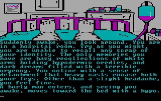


| address | `00 01 02 03 04 05` |
| --------- | --------------------- |
| data    | `01 00 C9 03 50 A0` |

Looking at the header, we see:

- `0100` = palette 1 (KCMW), low-intensity and black background.
- `C903` = unknown
- `50A0` = in form hhww, this is equivalent to WxH 160x80; note the width is doubled for IBM, so the image takes up the full screen horizontally and the top 40% of screen vertically, giving plenty of space for text below.


| offset | `00 01 02 03 04 05 06 07 08 09 0A 0B 0C 0D 0E 0F` |
| -------- | --------------------------------------------------- |
| 00     | `-- -- -- -- -- -- FF FF FF FF FF FF FF 11 00 FF` |
| 10     | `71 FC F0 11 01 05 11 15 54 11 51 11 13 55 FF 61` |
| ...    |                                                   |

Looking at the pixel data, we see that it's pretty boring at first: 61 pixels down of all white. Then 1 of all black, and seven more all white. Finally, a set of 1 pixel-high mixed black and white, and then some black and cyan until the bottom of the picture height, and back to the top of the screen (shifted by 4 pixels to the right) for the next block of white.

Note that this file doesn't include the feet shown; these are drawn with a small separate picture file (called FEET), then HOSPITL is redrawn when the player stands up.

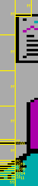


| address | color data                                                                                                                                                | height  |   | address | height  | color data                                                                                                           |
| --------- | ----------------------------------------------------------------------------------------------------------------------------------------------------------- | --------- | --- | --------- | --------- | ---------------------------------------------------------------------------------------------------------------------- |
| 06      | `FF`=<code style="color : White">W W W W</code>                                                                                                           | `F`=x15 |   | 08      | `F`=15x | `FF`=<code style="color : White">W W W W</code>                                                                      |
| 09      | `FF`=<code style="color : White">W W W W</code>                                                                                                           | `F`=x15 |   | 0B      | `F`=15x | `FF`=<code style="color : White">W W W W</code>                                                                      |
| 0C      | `FF`=<code style="color : White">W W W W</code>                                                                                                           | `F`=x1  |   | 0E      | `1`=1x  | `00`=<code style="color : DarkGray">K K K K</code>                                                                   |
| 0F      | `FF`=<code style="color : White">W W W W</code>                                                                                                           | `7`=x7  |   | 11      | `1`=1x  | `FC`=<code style="color : White">W W W</code><code style="color : DarkGray">K</code>                                 |
| 12      | `F0`=<code style="color : White">W W</code><code style="color : DarkGray">K K</code>                                                                      | `1`=x1  |   | 14      | `1`=1x  | `01`=<code style="color : DarkGray">K K K</code><code style="color : Cyan">C</code>                                  |
| 15      | `05`=<code style="color : DarkGray">K K</code><code style="color : Cyan">C C</code>                                                                       | `1`=x1  |   | 17      | `1`=1x  | `15`=<code style="color : DarkGray">K</code><code style="color : Cyan">C C C</code>                                  |
| 18      | `54`=<code style="color : Cyan">C C C</code><code style="color : DarkGray">K</code>                                                                       | `1`=x1  |   | 1A      | `1`=1x  | `51`=<code style="color : Cyan">C C</code><code style="color : DarkGray">K</code><code style="color : Cyan">C</code> |
| 1B      | `11`=<code style="color : DarkGray">K</code><code style="color : Cyan">C</code><code style="color : DarkGray">K</code><code style="color : Cyan">C</code> | `1`=x1  |   | 1D      | `3`=3x  | `55`=<code style="color : Cyan">C C C C</code>                                                                       |
| 1E      | `FF`=<code style="color : White">W W W W</code>                                                                                                           | `6`=x6  |   | ...     | `1`=1x  | ...                                                                                                                  |

### Commodore 64 graphics format

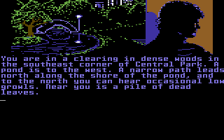

The Commodore 64 ports use 160x200 "Multicolor" resolution. At this resolution the C64's VIC-II graphics chip was capable of 16 colors at a time, however with some limtations: only 4 colors are allowed per 8x8 pixel block (3 colors plus a global background). That said, I don't think there's ever more than 8 colors total in any of these pictures.

The developers had to use a thin blocky font with the C64 because of the limited horizontal resolution.

At this point, I've managed to get almost all of the files decoded. There are still a few that are bugged partway through.

It's a different format from IBM, but the header has similarities, and there are similar sets of three byte sequences. However, here the file is divided into 4 different sections:

* Section 1: Header
* Section 2: Tertiary Color
* Section 3: Primary and Secondary Colors
* Section 4: Bitmasks

The Sections are delimited by the two byte picture dimensions (e.g., `50 80` in the "hosptl" example).

The header seems to start with a version number, either `00 10` for the first 4 published games, or `20 41` for the last four published games (*Oz* and the three from 1985).

Like the IBM picture data, these are also divided into run-length encoded 3-byte sequences. Section 2 and 3 provide color data for the picture, divided into 4x8 blocks, laid out vertically, with the primary two colors in Section 3 and a tertiary color in Section 2.

Section 3's three-byte sequence specifies two colors in the first and third bytes (each nibble representing a color from the C64 palette*), two run-lengths in the second byte (nibble 1 referencing byte 1's colors and nibble 2 referencing byte 3's colors). Each run-length is over a number of 4x8 blocks.

| 0        | 1        | 2            |   | 3            | 4        | 5        |
| ---------- | ---------- | -------------- | --- | -------------- | ---------- | ---------- |
| color A2 | color A1 | num blocks A |   | num blocks B | color B1 | color B2 |

Section 2 is the same as Section 3, but the low nibble of byte 2 is the third color for some number of 4x8 blocks, and the high nibble is always zero.

Section 4's three-byte sequence, like the IBM version above, specifies a 4x1 bitmask in the first and third bytes, and two run-lengths in the second byte, nibble 1 referencing byte 1's bitmask and nibble 2 referencing byte 3's bitmask.

##### \* = C64 palette: 0=black, 1=white, 2=red, 3=cyan, 4=purple, 5=green, 6=blue, 7=yellow, 8=orange, 9=brown, A=lt.red, B=dk.gray, C=md.gray, D=lt.green, E=lt.blue, F=lt.gray

It does seem that `2` (red) is [sometimes?] remapped as `A` (light red) and `6` (blue) is remapped as `E` (light blue).

So, returning to *Nine Princes* for our example:

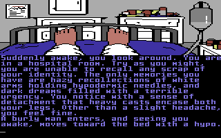

At address 0x65 (after the third reference to [50A0], the resolution), is an example of Section 3:

| 0x65       | 0x68       | 0x6B       | 0x6E       |
| ------------ | ------------ | ------------ | ------------ |
| `F0 71 FC` | `6C 11 60` | `1F 12 10` | `1F 13 0F` |

Looking at `F0`, Color `F` (15) is light gray and Color `0` is black. The first color is used as the background color of a number of 4x8-pixel blocks provided by the first nibble of the second byte (here `7`), from top to bottom. The second color is the foreground color for the same set of blocks (which will be used by another part of the file). In other words, at this stage we fill a 4x56 square with light gray, and remember black to be used later. The next nibble of the second byte, "num blocks B", is `1`, saying that the third byte's two colors are going to apply to just one 4x8-pixel block. Looking at the "hosptl" picture, this block contains 3 colors in the division between wall and floor; the wall being color `F` (light gray), the floor being color `C` (medium gray), and the dividing line being color `0` (black). Then looking to the next three bytes, `6` is blue which is used for the bed (though it gets remapped to `A`, light blue), and so it goes.

The availability of black to be used for the dividing line mentioned above comes from Section 2. So if you check Section 2 above at address 0x0A:

| 0x0A       | 0x0D       | 0x10       | 0x13       |
| ------------ | ------------ | ------------ | ------------ |
| `00 FF 00` | `00 F2 00` | `0C 19 00` | `06 34 00` |

You'll see that in this case `0` is the tertiary color for the first 47 4x8 blocks (`F` + `F` + `F` + `2` = 15 + 15 + 15 + 2), which includes the block in question.

### Apple II graphics format

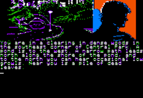 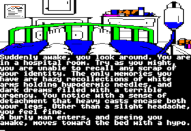

The Apple II ports use 280x192 "HIRES" resolution, with 6 colors. The Apple II is an odd duck; it's actually monochrome, but the pixel layout in conjunction with NTSC color burst signals results in the colors being displayed.

I've mostly got this one figured out. There's a couple of files that are skewed, and many from *Nine Princes* are cut off at the end (though in that case it could be the PDS extraction is to blame).

The initial header has 7 bytes (one additional compared to PC). I'm currently not sure of the purpose of these other than the width and height at address 0x05 and 0x06.

After this, here again are the three-byte sequences, but now instead of four pixels with vertical runlengths as in the IBM CGA files, it's seven subpixels. This actually makes sense because of the strange way Apple II graphics are set in memory. The bits in the first and third bytes are split into sequences, little-endian order. Seven bits are read right-to-left and placed horizontally left-to-right onscreen, with 0 representing "off" and 1 being "on". The first (leftmost) bit sets the palette (which is actually the color burst orientation). So two "off" subpixels result in a black pixel, and two "on" subpixels result in a white one. When an odd "on" subpixel adjoins an even "off" one, it results in either a green (with `0` palette) or orange (with `1` palette) pixel. Finally, when an odd "on" subpixel adjoins an even "off" one, we get a purple (`0`) or blue (`1`) pixel.

In other words, if the 8 bits of a byte in binary are laid out like this: **PQRSTUVW** then the purpose of each bit is:
palette = **P**
subpixel layout (odd) = **WV UT SR Q**
subpixel layout (even) = **W VU TS RQ**

To determine color, couples of adjoining odd and even bits (in conjunction with the palette) can be examined. Assuming this is an odd column, then for the rightmost subpixel (Q in the pattern above), you can't determine the appropriate color until you've gone down the screen and come back up to the same y-value, 7 subpixels to the right, to then combine it with the leftmost subpixel (W) of that 7-bit pattern. This wouldn't have mattered as much for the Apple II since it was all an artifact of the hardware, but for the purposes of emulating the result that means we have to process the contents in two passes, where the first pass generates a monochrome subpixel map and the second pass examines subpixel couples to produce the final color pixel map.

Palette Colors:

| palette | `00`    | `01`     | `10`     | `11`    |
| --------- | --------- | ---------- | ---------- | --------- |
| `0`     | 0=Black | 1=Green  | 2=Purple | 3=White |
| `1`     | 4=Black | 5=Orange | 6=Blue   | 7=White |

Example:

| hex  | binary        | palette | subpixel bits           | color sequence                                                                                                      |
| ------ | ------------ | --------- | ------------------------- | --------------------------------------------------------------------------------------------------------------------- |
| `67` | `0b0110_0111` | `0`     | odd:`11` `10` `01` `1`  | <code style="color : White">W</code> <code style="color : Magenta">P</code> <code style="color : Green">G</code> ?? |
|      |               |         | even:`1` `11` `00` `11` | ?? <code style="color : White">W</code> <code style="color : Gray">K</code> <code style="color : White">W</code>    |

So `00` is black and `11` is white, regardless of palette. `10` (assuming an odd column and palette `0`) is purple, and `01` might be green, but since these are 7-subpixel patterns, every other vertical stripe changes which bit is even and which is odd. Worse, if the palette changes then at the interface where the palettes differ, undesired artifacts occur. There is an automatic half-pixel shift to prevent severe glitches in both vertical and horizontal directions, but the [color fringes](https://www.xtof.info/hires-graphics-apple-ii.html#hires-oddities) that occur either need to be suffered, or the artist/programmer would have needed to carefully design their art to work around the issues. This includes needing to be aware of using the "correct" black or white (ie., 0 vs. 4, or 3 vs. 7, as numbered in the palette map above). What fun that all must have been!

When converting to PNG, I'm not currently trying to produce an image with any real fidelity to Apple II hardware. I could, following the behavior of some modern emulators, at least duplicate the white banding at horizontal palette interfaces. However, this would require doubling the horizontal resolution to accommodate.

### Atari ST graphics format

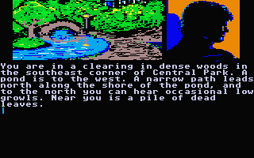 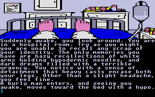

The Atari ports use their low resolution 320x200 mode, and like IBM most pictures are multiplied by 2 across the horizontal to fill the screen.

Though the ST had a more flexible color system than the Commodore (e.g., it could display 16 colors from 512 possible without any of the 8x8 block limitations), Telarium didn't really leverage it very well, and just stuck to a max of 8 colors. They also relied solely on the default system palette.*

##### \* = Atari ST default palette: 0=white, 1=black, 2=red, 3=green, 4=blue, 5=cyan, 6=yellow, 7=magenta, 8=lt.Gray, 9=dk.gray, A=dk.red, B=dk.green, C=dk.blue, D=dk.cyan, E=Brown, F=dk.magenta

Looking at the header, the first two bytes are the file size. Address 0x03 and 0x05 have the resolution; instead of `hh ww` as all of the other files so far, the resolution here is width first, and with `00` separators (or perhaps the spread was with the idea of supporting higher resolutions).

Following the resolution, there is a sequence that is common to most files:

`00 0F 00 00 0F 00 0D 0B 0F 0B 09 0B 0F 0D 00 00 0B 0F 0F 0D 08 0F 06 00 09 08 09 0B 0E 0D 00 0F 0F 0F 02 03 01 0E 09 0E 0C 08 0A 0C 03 0E`

This is the 16-color palette. The *Treasure Island* palette is slightly different, and *Amazon* is quite different and even differs between files.

The high nibble is always zero, but the low nibble varies from 0-F rather than 0-7 as I would think it should for 512 possible colors. In any case, after some experimentation, it looks like it's not laid out in RGB order, i.e. 'R0 G0 B0 R1 G1 B1 R2 G2 B2...' but rather it appears to be "ramped", so first occurs each red, then each green, then each blue, i.e. 'R0 R1 R2... G0 G1 G2... B0 B1 B2...' So you'll need to parse the whole thing and collate it.

So the following is the most common palette, after collating the values. The Rgb24 equivalent is found by multiplying by 17 (so e.g., `09` becomes `99`):

| hex   | `00 00 00` | `02 00 0D` | `00 0B 0F` | `0F 0F 0F` | `00 0F 02` | `00 0D 03` | `0F 07 00` | `00 0F 0E` |
| ------- | ------------ | ------------ | ------------ | ------------ | ------------ | ------------ | ------------ | ------------ |
| Rgb24 | #000000    | #2200DD    | #00BBFF    | #FFFFFF    | #00FF22    | #00DD33    | #FF7700    | #00FFEE    |
| Name  | 0=Black    | 1=Blue     | 2=Dk.Cyan  | 3=White    | 4=Green    | 5=Dk.Green | 6=Red      | 7=Cyan     |

| hex   | `0D 06 09` | `0B 00 0E` | `0F 09 0C` | `0B 08 08` | `09 09 0A` | `0B 0B 0C` | `0F 0E 03` | `0D 0D 0E` |
| ------- | ------------ | ------------ | ------------ | ------------ | ------------ | ------------ | ------------ | ------------ |
| Rgb24 | #DD6699    | #BB00EE    | #FF99CC    | #BB8888    | #9999AA    | #BBBBCC    | #FFEE33    | #DDDDEE    |
| Name  | 8=Dk.Red   | 9=Purple   | A=Pink     | B=Brown    | C=Dk.Gray  | D=Md.Gray  | E=Yellow   | F=Lt.Gray  |

The next section begins at address 0x36, and is split into up to 4 bitplanes. The output is in 4x2 blocks, and unlike the prior formats these are laid out horizontally. 0x00 and 0xFF, though they are also valid values (see below), use the following byte as a run-length.

The first nibble is the top 4 pixels, and the second nibble is the bottom 4. The layout is very simply obtained by converting the nibble to binary.

Examples:

| nibble | binary | pixel mockup |
|--------|--------|--------------|
| `0x0`  | <code style="color : DarkGray">0 0 0 0</code> | <code style="color : DarkGray">____</code>         |
| `0x1`  | <code style="color : DarkGray">0 0 0</code><code style="color : White">1</code> | ___<code style="color : White">█</code>         |
| `0x6`  | <code style="color : DarkGray">0</code><code style="color : White">1 1</code><code style="color : DarkGray">0</code> | <code style="color : DarkGray">\_</code><code style="color : White">██</code><code style="color : DarkGray">\_</code>         |
| `0xC`  | <code style="color : White">1 1</code><code style="color : DarkGray">0 0</code> | <code style="color : White">██</code><code style="color : DarkGray">__</code>         |
| `0xF`  | <code style="color : White">1 1 1 1</code> | <code style="color : White">████</code>         |

So putting the nibbles together, e.g., `0x88` would be two pixels on the left side of the 4x2 block.

Likewise, `0x00` is an empty 4x2 block of pixels, and `0xFF` is a completely filled block, though as mentioned above, these two values expect a run-length to follow.

If there are two or more `0x00`s in a row, then each byte couple adds 256 to the next run-length (i.e., `00 00 00 00 00 9B` becomes run-length `0x29B`).

Finally, as to determining the final colors, the layout of the pixels on each bitplane gives a component of a bitmap for each pixel to ultimately derive the palette index. We collate the values from each of the bitplanes to build 4-bit binary numbers for each pixel from right to left. So an "on" pixel in bitplane 0 adds `0b0001` (1) to the palette index, an "on" in bitplane 1 adds `0b0010` (2) to the palette index, one in bitplane 2 adds `0b0100` (4) to the palette index, and one in bitplane 3 adds `0b1000` (8) to the palette index. In this way, we can eventually specify each of the 16 colors in the palette.

Palette Index Example:

| bitplane | value |
|----------|-------|
| 0        | `0`   |
| 1        | `1`   |
| 2        | `0`   |
| 3        | `1`   |

Again, the number is built right to left, so for this example this results in a bitmap value of `0b_1010` (0xA) for the corresponding pixel, which, if using the most common of the custom palettes shown above, would be pink.

### Macintosh graphics format

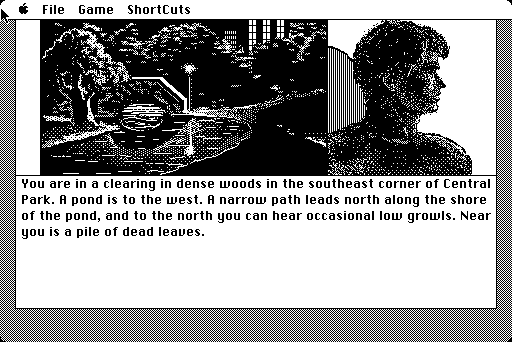

The three games that were ported to Mac use a similar art style to the other ports, but in a higher resolution--though the Mac's full screen resolution is 512x342, the game only uses 480x300--and in black-and-white only (not even grayscale), as that's all that the first Macs supported.

The first two bytes of the header are the width in pixels, and the next two are the height.

For the *Fahrenheit 451* images, Spinnaker just used a standard Macintosh RLE format called PackBits. The Tester Tool extracts these files too, but there are several implementations available [elsewhere](https://github.com/skirridsystems/packbits).

As for *Amazon* and *Dragonworld*, they use a custom format:

Address 0x04 is always `00`, and address 0x05 is either `00` or `01`; when it is `01`, the picture is rotated by 270&deg; (i.e., 90&deg; counter-clockwise), which I'm guessing is about capitalizing on vertical run-length encoding when horizontal encoding would be less effective.

The range from address 0x06 to 0x15 is a bitmap lookup table. There are two 8-byte sections, but the sections are reversed when referenced, i.e., index 2 at address 0x07 is referenced by `A`, and index 10 at address 0x11 is `2`. You'll find that the unused values at indices 0 and 8 are always `00`.

The picture data begins at address 0x16, and every nibble needs to be considered separately. If a nibble is less than `8` (including `0`), then the following nibble is a run-length. If the nibble is either `0` or `8`, then the next two nibbles (in the case of `0`, the next two *after* the run-length) are used as a literal bitmap. If the nibble was `1`-`7` (followed by a run-length) or `9`-`F` (without a run-length), then that is the index of a byte in the lookup table.

And that's it! You now have a series of bytes where each is an 8-pixel wide stride, laid out horizontally (or vertically if rotated). This being a Mac, `0` is white and `1` is black.

### MSX graphics format

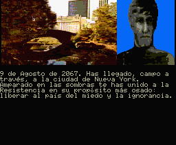 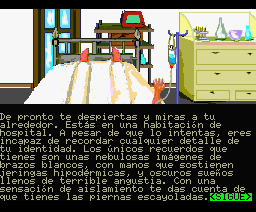

These "ports" were released by a different company, and the art was redrawn with a new art style, and in some cases appear to have included digitized photographs. I don't believe these are actually SAS games, but rather adaptations to a different engine.

---

## Sound Formats

These games feature some music and sound effects that are... serviceable.

I've got the format figured out for the most part, but there are some bugs to work out. For what it's worth, the Tester Tool permits you to export all audio files to .MID for all games (except MSX ports) as far as my current understanding goes (and will automatically extract files from PDS containers first), but the pitch is incorrect in some cases.

The tool will also preview sound files for individual games, but in that case it will only play one channel at a time.

So here's what I've deciphered so far:

### IBM PC/PCjr sound format

The IBM ports come with two sound file formats, \*.IB for the IBM PC speaker (monophonic) and \*.JR for the IBM PCjr [TI SN76489 chip](https://en.wikipedia.org/wiki/Texas_Instruments_SN76489) (polyphonic, featuring a 3-channel square wave generator, and a 1-channel white noise generator, though I'm pretty sure the noise channel is not used on the IBM ports).

#### Header

The first byte (at 0x00) is highly variable; it seems to be a buffer size, as I got it to play part of a prior sound file after increasing the size. The second byte (0x01) has a very small range (`00`-`02` I think). The first often varies between IB and JR formats, and the second sometimes does as well.

The third (0x02) does not appear to vary between formats. It represents the timespan of the shortest beat length. The range is also small (`01`-`08`). I believe you simply multiply the number by 16 to get the number of milliseconds for each beat (so larger numbers equal a slower tempo).

0x03 and 0x04 seem to always be `18 00`.

For monophonic files (which includes many of the \*.JR files which are duplicates of the \*.IB ones), the next 6 bytes are all `00`s, whereas for polyphonic \*.JR files, 0x05 and 0x07 often have a wide variance, where positions 0x06 and 0x08 have a very small range (`00`-`03`), though usually both are `00`. Based on my limited experiments, 0x05 and 0x07 seem to adjust both octave and starting position of the track, for the second and third channel respectively; where 0x06 and 0x08 might be adjustments to the buffer size.

0x09 and 0x10 are always `00`.

#### Note Lengths

The 15 bytes between positions 0x0B and 0x19 comprise a new section that specifies an array of note lengths that are used in the section below.

#### Note Data

For the rest of the file, starting at 0x1A, we have note data. The control code at the beginning is always `50 00 08 40 00 80` on IBM. For polyphonic files, a similar sequence starting with `50` will start a new channel after an `80` stop control code. The new channel begins at the beginning of the song and plays at the same time as the prior channel. I'm unclear on some of the specifics of this sequence, but the `08 40` is used for the PC speaker or for square waves on the PCjr. Other ports sometimes have different waveform values. Also, the `80` at the end doesn't indicate a stop (or even a start) control code as it would during the note data proper; it can differ in some ports.

The first byte that follows the new channel sequence could indicate one or more rests (see next section below), but before the first audible note there should be a `00` followed by a byte between `C2` and `FF`. This indicates an absolute pitch value. This may seem a fairly narrow range of values to represent a ~2500 Hz range, except that since only musical notes will be specified, this actually covers more than 4 octaves of a chromatic scale (and the frequency curve is exponential anyway). See the chart below for some examples. It looks like you can set it to a lower pitch (below A3) with values below `C2` (though it will go no lower than C at octave zero). From my experiments, it seems that notes don't cross over the `C2` line, i.e., pitch changes (see next section below) may end up going down instead of up. The same is not true for pitch changes that go above `FF`; those seem to be allowed.


| hex  | note | midi # | freq (Hz) |
| ------ | ------ | -------- | ----------- |
| `C2` | A2   | 45     | 110.00    |
| ...  |      |        |           |
| `D1` | C4   | 60     | 261.63    |
| ...  |      |        |           |
| `E0` | Eb5  | 75     | 622.25    |
| ...  |      |        |           |
| `F0` | G6   | 91     | 1568.0    |
| ...  |      |        |           |
| `FF` | Bb7  | 106    | 3729.3    |

For the following note values, each byte represents one note or rest. The first nibble is the relative note pitch compared to the prior pitch, with 0 indicating the same note, 1-7 indicating the number of notes above, and 9-F indicating the number of notes below, with `F`=-1, `E`=-2, `D`=-3, etc. to `9`=-7.

If the first nibble is 8, then it is a rest (no sound for the same duration as if it was a regular note)--except for `80`, which remember is the stop control code. A rest does not change the pitch; the pitch of the note following one or more rests is based on the note prior to the rests.

A `00` within the note values seems to indicate a key change, though the value is still relative to the prior note. If the first nibble is 0-7, then the key moves up; I believe the first nibble is the number of octaves; the second is definitely the number of semitones (a.k.a. half-steps). If the first nibble is 9-F, then the key moves down. The second nibble should be subtracted from 0x10 to get the number of semitones to lower, i.e., `F7` means 0x10(16)-0x07(7)=9.

I'm not sure what 2 `00`s indicate...

#### Example

##### AMB\\AMBHORN.IB

This is a short example from *Nine Princes* that mimics the sound of a hunting horn.


| offset | `00 01 02 03 04 05 06 07 08 09 0A 0B 0C 0D 0E 0F`                                                                                     |
| -------- | --------------------------------------------------------------------------------------------------------------------------------------- |
| 000    | `2B 00 08 18 00 00 00 00 00 00 00`<code style="color : Blue">01 06 02 10 01</code>                                                    |
| 010    | <code style="color : Blue">01 01 01 01 01 01 01 01 01 01</code><code style="color : Green">50 00 08 40 00 80</code>                   |
| 020    | <code style="color : Green">00 C6</code><code style="color : Red">01 72 81 91 71 83 91 74</code><code style="color : Green">80</code> |

The first section is the header. I do know that the value `08` at 0x02, multiplied by 16 (here, 128), represents the timespan in milliseconds per beat. A beat might be thought of as an eighth note (&#9834;) or a sixteenth note (&#x1D161;) or even a 32nd note, depending on the tempo. You should be able to calculate a tempo in standard quarter-note (&#9833;) beats per minute by first multiplying the length in ms by 2 (for 8th note), 4 (for 16th note), or 8 (for 32nd note) to get the length in ms of a quarter note, then use the formula "bpm = 60,000 &div; (beat length &times; note length)". In other words, if the beats in this file are thought of as 16th notes, then the tempo is 60,000 &div; (128 &times; 4), i.e.: &#9833;=117 bpm (where 108-120 is considered moderate).

The second section at 0x0B is the 15-element array of note lengths. In this case, in decimal the array is: { 1, 6, 2, 16, 1, 1, 1, 1, 1, 1, 1, 1, 1, 1, 1 }.

The next section at 0x1A is the control sequence at the start of a channel, which on IBM will always be the same. The same sequence will be repeated at the start of a new channel for polyphonic files.

`C6` (at 0x21) is the absolute pitch at the start of the (only) channel. It corresponds with C# in the fourth octave. The following section represents notes. `01` indicates no pitch change from the prior value, for the note length in the first index of the array (in this case, one beat). `72` indicates a rise of 7 semitones (i.e., C#->D->D#->E->F->F#->G->G#) up to G#, still in the fourth octave, for the length provided in the second index of the array (six beats). The next byte, `81`, since the first nibble is 0x8 and it's not `80` (the stop control code), then it's a rest for the length in the first index of the array (one beat). `91` indicates a fall by 7 half-steps, returning us to C#4, for one beat. In the end, the entirety of the audio is:

C#4 x1, G#4 x6, rest x1, C#4 x1, G#4 x1, rest x2, C#4 x1, G#4 x16

It sounds like: "Da-doooo, da-do da-dooooooo!" [Listen to the MIDI conversion here](https://codepen.io/Nutzzz-the-animator/full/wBzMzbP).

And finally, we get the `80` stop control code.

### Apple II sound format

The three models prior to the IIGS had a very basic speaker. Add-in music cards were available, but SAS only supports this speaker.

Because of this, the sound files are very similar to the .IB versions. There are three extra bytes at the start of the file, however, so the note data doesn't start until address 0x23.

### Atari ST sound format

All four models prior to the STe had a [Yamaha YM2149](https://en.wikipedia.org/wiki/General_Instrument_AY-3-8910), which apparently produces "similar results" to the chip in the PCjr.

Given that, perhaps it should not be surprising that the sound files are very similar to the PCjr versions; some are actually identical.

#### Atari ST sound format differences for *Nine Princes* and *Perry Mason*

For AMB and PMN (the last 2 SAS games to be released), the Atari control code format is a bit different from the other Atari ports (though note AMB has its music files packed into a MUSICPDS file). The first channel uses 8 bytes instead of 6, but later channels only use 2 bytes. The first channel often begins with `50 00 00 00 38 00`. The following two bytes always start with `60`, which is usually followed by `0D`, but is sometimes `0E`, `0F`, or `10`. This seems to be the waveform type: `0D` is a square wave, but I haven't yet figured out the others. The second and third channel codes consist of only 2 bytes, again `60` and one of `0D` through `10`.

### Commodore 64 sound format

The Commodore 64 files I've analyzed are also very similar to the PCjr ones. The C64's [MOS 6581 SID](https://en.wikipedia.org/wiki/MOS_Technology_6581) is 3-channel, though it is much more flexible with the sounds that it can output (i.e., each channel can use noise generation or 4 different waveforms *simultaneously*, filtration and ADSR envelope modification).

Note I have also heard at least one instance of the noise channel being used by the C64 in an emulator.

There are an additional two bytes at the beginning of a file, which are the same as those at the start of the [graphics files](#commodore-64-graphics-format), either `00 10` or `20 41`, which I suspect is a version ID.

The control code at the start of a channel is a bit different. It's still six bytes starting with `50 00`, but the next 4 control the waveform (and ADSR envelope?). Initially I thought the `80` in the sixth byte for IBM and Atari meant that it was both start and stop, but since it varies here it probably doesn't mean start at all. The third byte seems to always be `08` or `0F`. The latter seems to add a duplicate waveform (sawtooth maybe?) with the same pitch on top, though it only seems to work if it is followed by `40` (square wave); as the fourth byte is the waveform type: it seems that `10` is triangle and `20` is sawtooth; I believe `80` is white noise.

C64 also has a final byte after the last `80` that varies: I've seen e.g., `00`, `01`, `02`, `81`, and `FF`.

### Macintosh sound format

The Macintosh files are once again very similar to the PCjr; in fact, all the ones I've examined are identical to the Atari.

### MSX sound format

I have not yet begun to investigate these.
